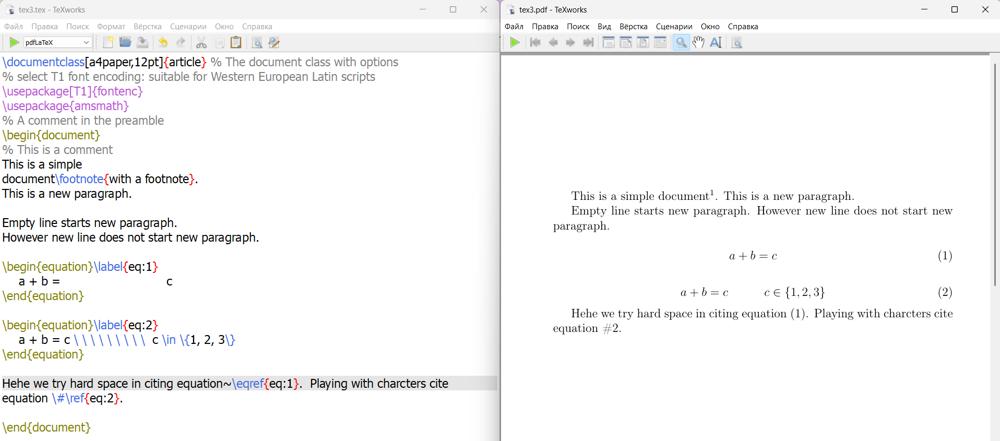

---
## Front matter
lang: ru-RU
title: Презентация по лабораторной работе №2
subtitle: Дисциплина "Computer Skills for Scientific Writing"
author:
  - Живцова А.А.
institute:
  - Кафедра теории вероятностей и кибербезопасности, Российский университет дружбы народов имени Патриса Лумумбы, Москва, Россия
date: 11 сентября 2024

## i18n babel
babel-lang: russian
babel-otherlangs: english

## Formatting pdf
toc: false
toc-title: Содержание
slide_level: 2
aspectratio: 169
section-titles: true
theme: metropolis
header-includes:
 - \metroset{progressbar=frametitle,sectionpage=progressbar,numbering=fraction}
---

# Информация

## Докладчик

:::::::::::::: {.columns align=center}
::: {.column width="70%"}

  * Живцова Анна Александровна
  * студент кафедры теории вероятностей и кибербезопасности
  * Российский университет дружбы народов имени Патриса Лумумбы
  * [zhivtsova_aa@pfur.ru](mailto:zhivtsova_aa@pfur.ru)
  * <https://github.com/AnnaZhiv>

:::
::: {.column width="30%"}

:::
::::::::::::::

# Вводная часть

## Актуальность

Использование LaTeX  критически важно для исследователей, так как это профессиональный стандарт для подготовки научных статей. Он обеспечивает отличное качество вёрстки, позволяет легко работать с библиографией и ссылками, что значительно ускоряет процесс написания исследований. 

## Объект и предмет исследования

- Дистрибутив TexLive         
- Редактор TexWorks         
- Структура LaTex документа      

## Цели и задачи

Написать и скомпилировать первые документы с помоью LaTex.

- Написать и скомпилировать с помощью командной строки LaTex документы.     
- Написать и скомпилировать с помощью программы редактора LaTex документы, содержащие работу с абзацами, пробелами и специальными символами.      

## Материалы и методы

- Дистрибутив TexLive         
- Редактор TexWorks         
- Структура LaTex документа      

# Результаты

## Код и результат компиляции

{#fig:006 width=90%}