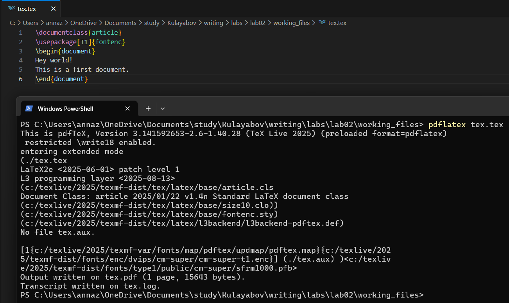
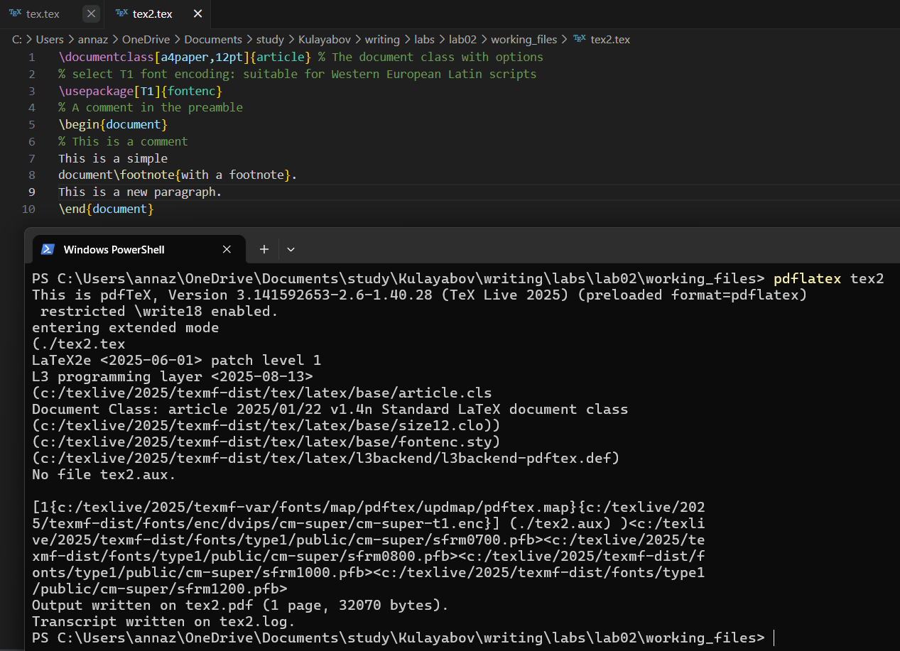
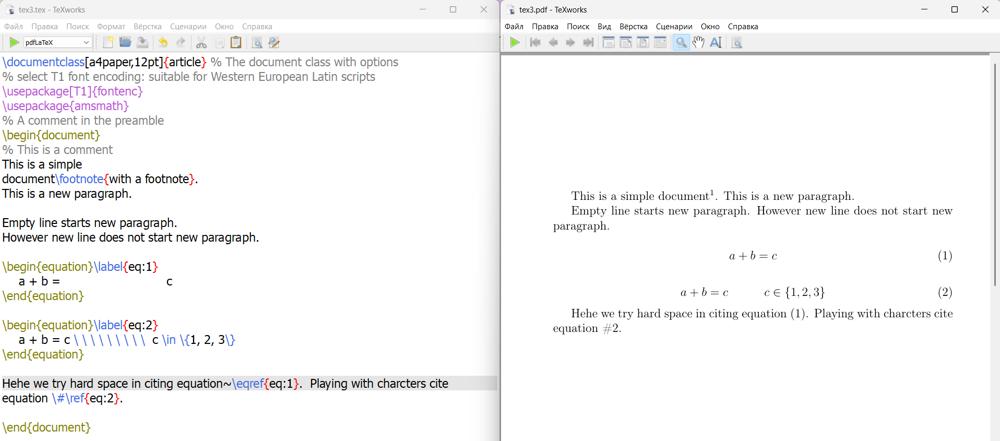

---
## Front matter
title: "Отчет по лабораторной работе №2"
subtitle: "Дисциплина: Computer Skills for Scientific Writing "
author: "Живцова Анна"

## Generic otions
lang: ru-RU
toc-title: "Содержание"

## Bibliography
bibliography: cite.bib
csl: pandoc/csl/gost-r-7-0-5-2008-numeric.csl

## Pdf output format
toc: true # Table of contents
toc-depth: 2
lof: true # List of figures
lot: true # List of tables
fontsize: 12pt
linestretch: 1.5
papersize: a4
documentclass: scrreprt
## I18n polyglossia
polyglossia-lang:
  name: russian
  options:
	- spelling=modern
	- babelshorthands=true
polyglossia-otherlangs:
  name: english
## I18n babel
babel-lang: russian
babel-otherlangs: english
## Fonts
mainfont: IBM Plex Serif
romanfont: IBM Plex Serif
sansfont: IBM Plex Sans
monofont: IBM Plex Mono
mathfont: STIX Two Math
mainfontoptions: Ligatures=Common,Ligatures=TeX,Scale=0.94
romanfontoptions: Ligatures=Common,Ligatures=TeX,Scale=0.94
sansfontoptions: Ligatures=Common,Ligatures=TeX,Scale=MatchLowercase,Scale=0.94
monofontoptions: Scale=MatchLowercase,Scale=0.94,FakeStretch=0.9
mathfontoptions:
## Biblatex
biblatex: true
biblio-style: "gost-numeric"
biblatexoptions:
  - parentracker=true
  - backend=biber
  - hyperref=auto
  - language=auto
  - autolang=other*
  - citestyle=gost-numeric
## Pandoc-crossref LaTeX customization
figureTitle: "Рис."
tableTitle: "Таблица"
listingTitle: "Листинг"
lofTitle: "Список иллюстраций"
lotTitle: "Список таблиц"
lolTitle: "Листинги"
## Misc options
indent: true
header-includes:
  - \usepackage{indentfirst}
  - \usepackage{float} # keep figures where there are in the text
  - \floatplacement{figure}{H} # keep figures where there are in the text
---

# Цель работы

Написать и скомпилировать первые документы с помоью LaTex  [@book]. 

# Задание

- Написать и скомпилировать с помощью командной строки LaTex документы.     
- Написать и скомпилировать с помощью программы редактора LaTex документы, содержащие работу с абзацами, пробелами и специальными символами.      

# Выполнение лабораторной 

Создала документ tex.tex и вставила код для разметки документа: открытие документа, текст и закрытие документа. Скомпилировала файл с помощью команды ```pdflatex tex``` и посмотрела результат с помощью средства просмотра документов (см. рис. [-@fig:001]).

{#fig:001}

Создала документ tex2.tex и вставила код для разметки документа: открытие документа, текст, подстрочная ссылка и закрытие документа. Скомпилировала файл с помощью команды ```pdflatex tex``` и посмотрела результат с помощью средства просмотра документов (см. рис. [-@fig:002]).

{#fig:002}

Создала документ tex3.tex и вставила код для разметки документа: открытие документа, текст, подстрочная ссылка, новый абзац, два уравнения, жесткий пробел, специальный символ # и закрытие документа. Скомпилировала файл с помощью LaTex редактора TexWork editor и посмотрела результат с помощью средства просмотра документов (см. рис. [-@fig:003]).

{#fig:003}

# Выводы

В данной работе я освоила работу с абзацами, отступами, пробеелами и специальными символами Latex.     

# Список литературы{.unnumbered}

::: {#refs}
:::
