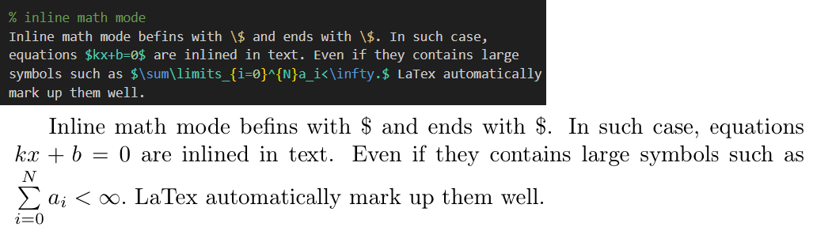
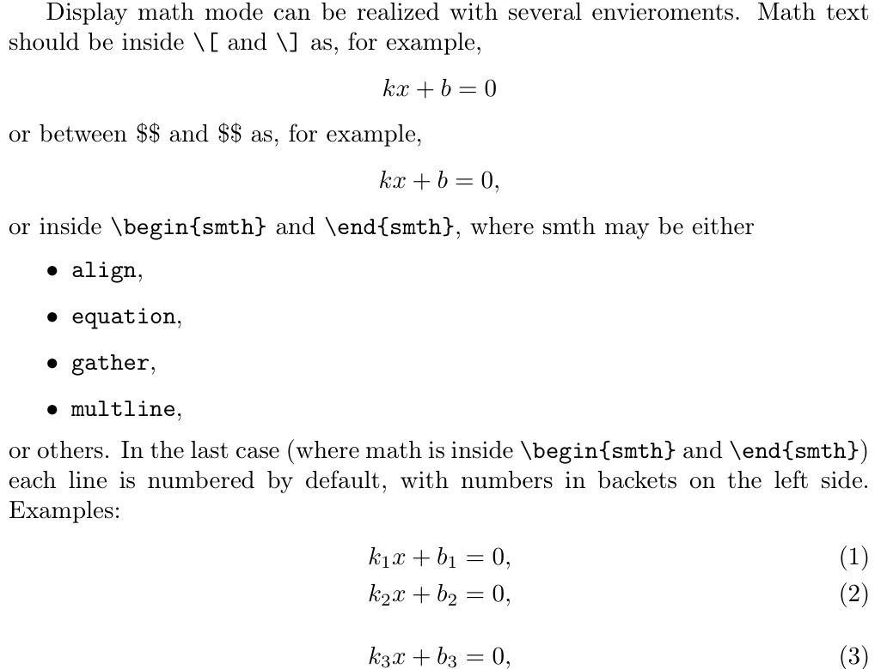
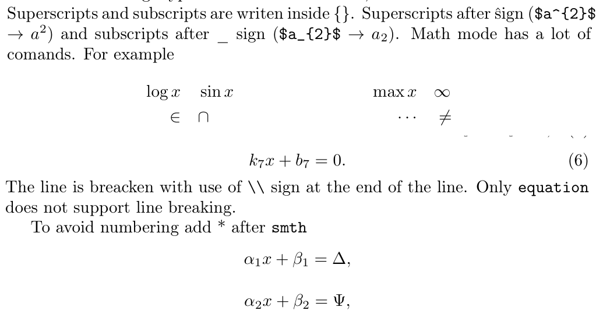
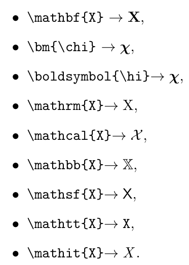

---
## Front matter
lang: ru-RU
title: Презентация по лабораторной работе №3
subtitle: Дисциплина "Computer Skills for Scientific Writing"
author:
  - Живцова А.А.
institute:
  - Кафедра теории вероятностей и кибербезопасности, Российский университет дружбы народов имени Патриса Лумумбы, Москва, Россия
date: 11 сентября 2024

## i18n babel
babel-lang: russian
babel-otherlangs: english

## Formatting pdf
toc: false
toc-title: Содержание
slide_level: 2
aspectratio: 169
section-titles: true
theme: metropolis
header-includes:
 - \metroset{progressbar=frametitle,sectionpage=progressbar,numbering=fraction}
---

# Информация

## Докладчик

:::::::::::::: {.columns align=center}
::: {.column width="70%"}

  * Живцова Анна Александровна
  * студент кафедры теории вероятностей и кибербезопасности
  * Российский университет дружбы народов имени Патриса Лумумбы
  * [zhivtsova_aa@pfur.ru](mailto:zhivtsova_aa@pfur.ru)
  * <https://github.com/AnnaZhiv>

:::
::: {.column width="30%"}

:::
::::::::::::::

# Вводная часть

## Актуальность

Использование LaTeX  критически важно для исследователей, так как это профессиональный стандарт для подготовки научных статей. Он обеспечивает отличное качество вёрстки, позволяет легко работать с библиографией и ссылками, что значительно ускоряет процесс написания исследований. 

## Объект и предмет исследования

- Метематические окружения LaTex     
- Специальные функции для верстки маематических формул            

## Цели и задачи

Целью лабораторной работы является освоение верстки математических формул с помощью языка разметки LaTex.

Для достижения цели реализуются следующие задчи:    
- Изучение основ синтаксиса LaTex для описания математических формул.     
- Изучение двух основных видов математических окружений -- inline и displayed.     
- Изучение списка специальных команд для математических операций и греческого алфавита.    
- Изучение меодов работы со шрифтом внутри математических окружений.    
- Реализация всех изученных механизмов на практике.        

## Материалы и методы

- Дистрибутив TexLive         
- Редактор TexWorks        
- Компилятор pdflatex            

# Результаты

## Inline окружение

{#fig:006 width=90%}

## Displayed окружение

{#fig:006 width=90%}

## Специальные символы

{#fig:006 width=90%}

## Шрифты математического окружения

{#fig:006 width=90%}