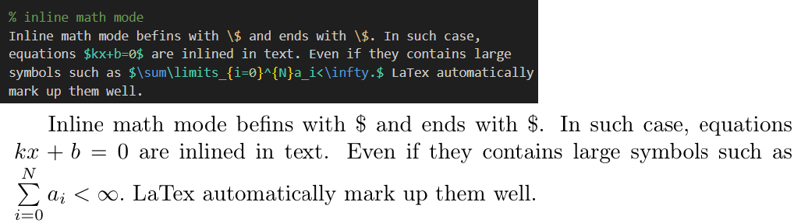
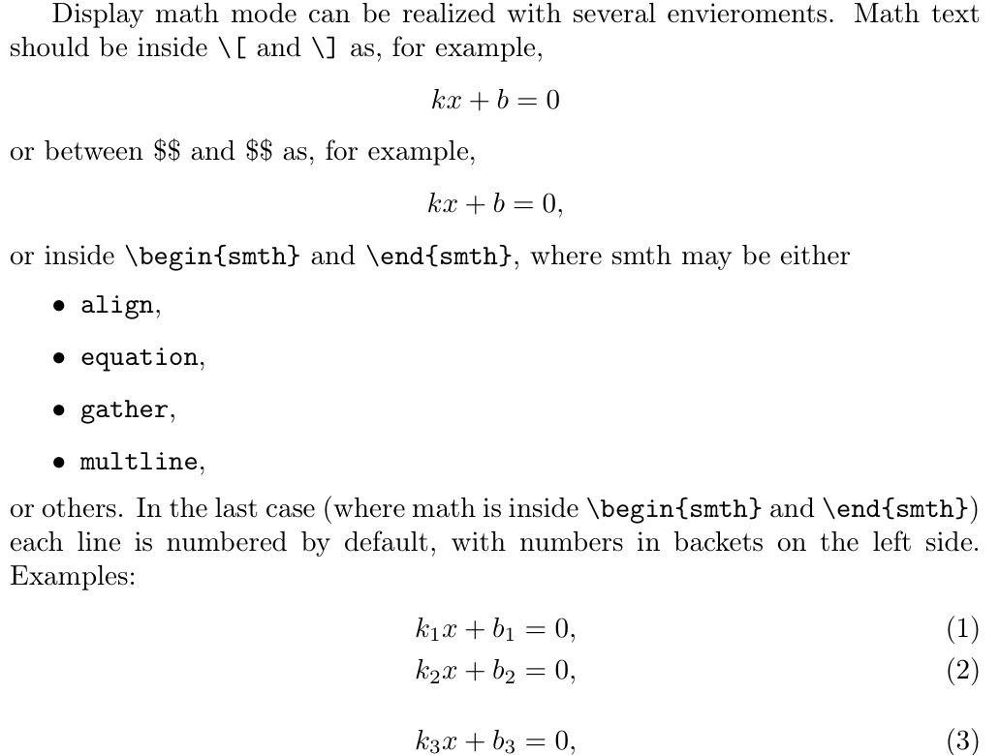
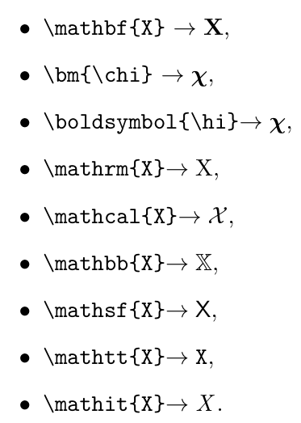
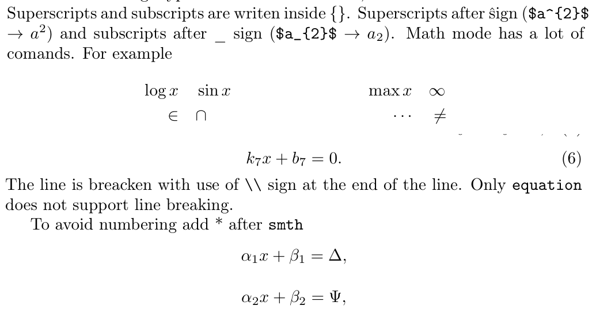
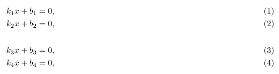
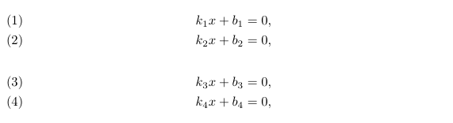

---
## Front matter
title: "Отчет по лабораторной работе №3"
subtitle: "Дисциплина: Computer Skills for Scientific Writing "
author: "Живцова Анна"

## Generic otions
lang: ru-RU
toc-title: "Содержание"

## Bibliography
bibliography: cite.bib
csl: pandoc/csl/gost-r-7-0-5-2008-numeric.csl

## Pdf output format
toc: true # Table of contents
toc-depth: 2
lof: true # List of figures
lot: true # List of tables
fontsize: 12pt
linestretch: 1.5
papersize: a4
documentclass: scrreprt
## I18n polyglossia
polyglossia-lang:
  name: russian
  options:
	- spelling=modern
	- babelshorthands=true
polyglossia-otherlangs:
  name: english
## I18n babel
babel-lang: russian
babel-otherlangs: english
## Fonts
mainfont: IBM Plex Serif
romanfont: IBM Plex Serif
sansfont: IBM Plex Sans
monofont: IBM Plex Mono
mathfont: STIX Two Math
mainfontoptions: Ligatures=Common,Ligatures=TeX,Scale=0.94
romanfontoptions: Ligatures=Common,Ligatures=TeX,Scale=0.94
sansfontoptions: Ligatures=Common,Ligatures=TeX,Scale=MatchLowercase,Scale=0.94
monofontoptions: Scale=MatchLowercase,Scale=0.94,FakeStretch=0.9
mathfontoptions:
## Biblatex
biblatex: true
biblio-style: "gost-numeric"
biblatexoptions:
  - parentracker=true
  - backend=biber
  - hyperref=auto
  - language=auto
  - autolang=other*
  - citestyle=gost-numeric
## Pandoc-crossref LaTeX customization
figureTitle: "Рис."
tableTitle: "Таблица"
listingTitle: "Листинг"
lofTitle: "Список иллюстраций"
lotTitle: "Список таблиц"
lolTitle: "Листинги"
## Misc options
indent: true
header-includes:
  - \usepackage{indentfirst}
  - \usepackage{float} # keep figures where there are in the text
  - \floatplacement{figure}{H} # keep figures where there are in the text
---

# Цель работы

Целью лабораторной работы является освоение верстки математических формул с помощью языка разметки LaTex.

# Задание

Для достижения цели реализуются следующие задчи:    
- Изучение основ синтаксиса LaTex для описания математических формул.     
- Изучение двух основных видов математических окружений -- inline и displayed.     
- Изучение списка специальных команд для математических операций и греческого алфавита.    
- Изучение меодов работы со шрифтом внутри математических окружений.    
- Реализация всех изученных механизмов на практике.    

В ходе выполнения лабораторной работы используются дистрибутив Texlive и компилятор pdflatex.  

# Выполнение лабораторной 

Первым делом протестируем inline математиеское окружение (см. рис. [-@fig:001])  [@book].

{#fig:001}
  
Далее смотрим на displayed окружение. Теория по применению этого типа оружения и примеры верстки приведены на рисунке [-@fig:002].

{#fig:002}

Следующим шагом тестируем ряд изменений шрифта, доступный внутри математического окружения (см. Рис. [-@fig:003]).

{#fig:003}

Далее испытываем некоторые специальные команды внутри окружения $\verb|align|$, позволющей разивать уравнения по горизонтали с помощью символов выравнивания \&. Также протестируем грееские символы и принудительное пекращение нумерации уравнений (см. Рис.  [-@fig:004])

{#fig:004}

Наконец протестируем опции $\verb|fleqn|$ и $\verb|leqno|$, используемые в команде $\verb|\documentclass|$, например следующим образом $\verb|\documentclass[fleqn]{article}|$. Первая опция используется для автоматического выравнивания уравнений по левой стороне. Вторая опция используется для автоматического расположения номеров уравнений слева страницы. Результаты компиляции документов с данными опциями приведены на рисункх  [-@fig:005] и [-@fig:006].

{#fig:005}

{#fig:006}

# Выводы

В данной работе я освоила работу с математическими окружениями в LaTex, позволяющими верстать профессионально оформленные математические тексты, без затруднений использовать специальные символы и дополнительные шрифты. Я изучила основы синтаксиса и протестировала несколько различных математических окружений. Дополнительно провела эксперимент добавления опций к классу документа, позволяющих изменить выравнивание по умолчанию.      

# Список литературы{.unnumbered}

::: {#refs}
:::
