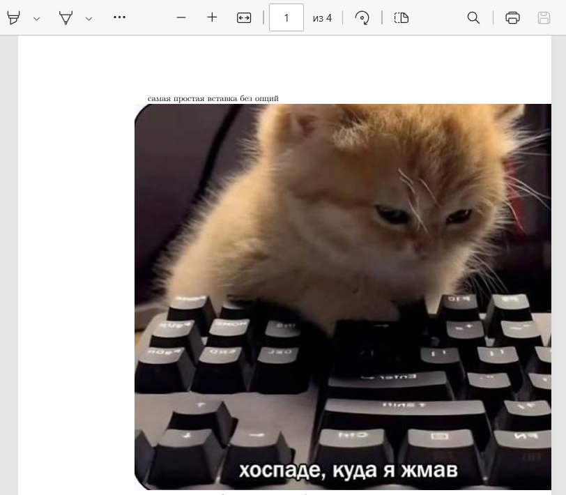
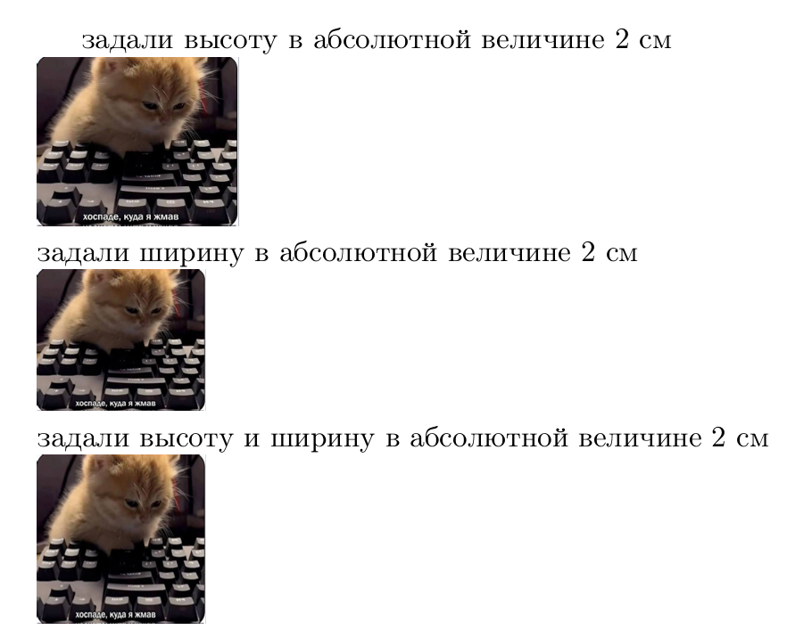
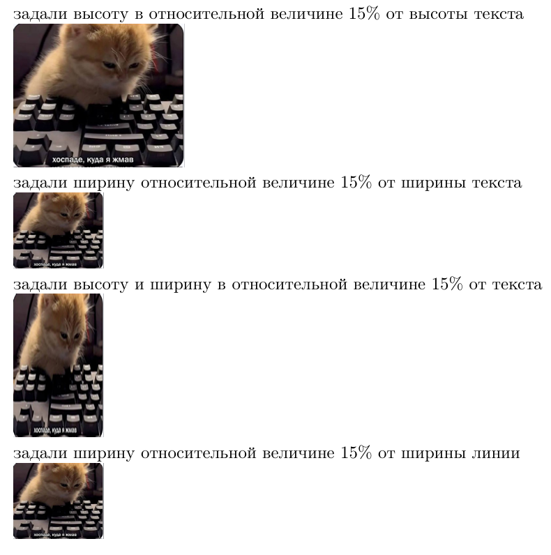
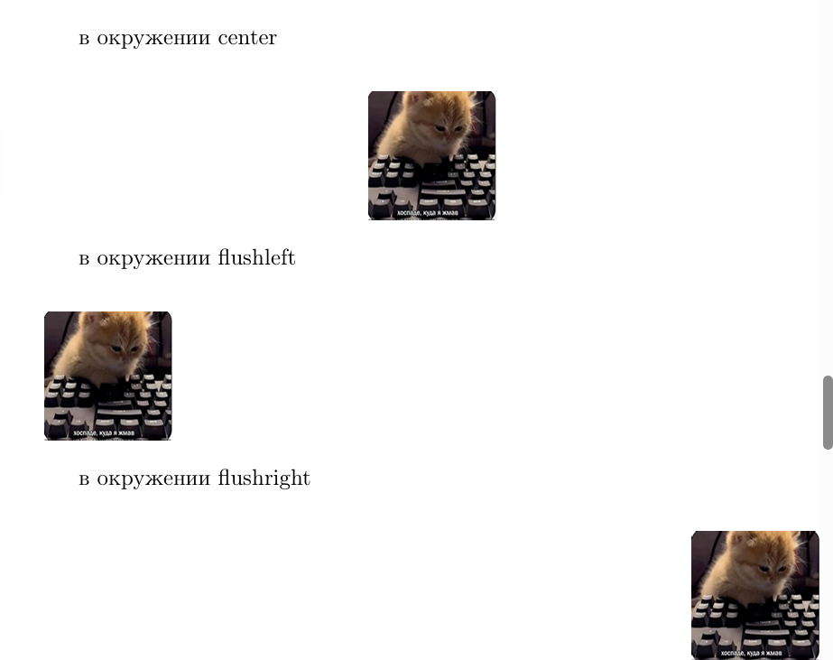
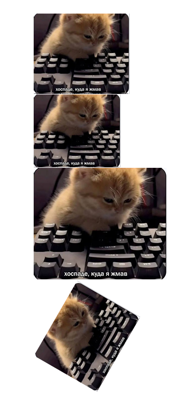
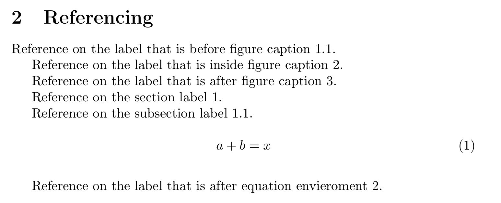

---
## Front matter
title: "Отчет по лабораторной работе №4"
subtitle: "Дисциплина: Computer Skills for Scientific Writing "
author: "Живцова Анна"

## Generic otions
lang: ru-RU
toc-title: "Содержание"

## Bibliography
bibliography: cite.bib
csl: pandoc/csl/gost-r-7-0-5-2008-numeric.csl

## Pdf output format
toc: true # Table of contents
toc-depth: 2
lof: true # List of figures
lot: true # List of tables
fontsize: 12pt
linestretch: 1.5
papersize: a4
documentclass: scrreprt
## I18n polyglossia
polyglossia-lang:
  name: russian
  options:
	- spelling=modern
	- babelshorthands=true
polyglossia-otherlangs:
  name: english
## I18n babel
babel-lang: russian
babel-otherlangs: english
## Fonts
mainfont: IBM Plex Serif
romanfont: IBM Plex Serif
sansfont: IBM Plex Sans
monofont: IBM Plex Mono
mathfont: STIX Two Math
mainfontoptions: Ligatures=Common,Ligatures=TeX,Scale=0.94
romanfontoptions: Ligatures=Common,Ligatures=TeX,Scale=0.94
sansfontoptions: Ligatures=Common,Ligatures=TeX,Scale=MatchLowercase,Scale=0.94
monofontoptions: Scale=MatchLowercase,Scale=0.94,FakeStretch=0.9
mathfontoptions:
## Biblatex
biblatex: true
biblio-style: "gost-numeric"
biblatexoptions:
  - parentracker=true
  - backend=biber
  - hyperref=auto
  - language=auto
  - autolang=other*
  - citestyle=gost-numeric
## Pandoc-crossref LaTeX customization
figureTitle: "Рис."
tableTitle: "Таблица"
listingTitle: "Листинг"
lofTitle: "Список иллюстраций"
lotTitle: "Список таблиц"
lolTitle: "Листинги"
## Misc options
indent: true
header-includes:
  - \usepackage{indentfirst}
  - \usepackage{float} # keep figures where there are in the text
  - \floatplacement{figure}{H} # keep figures where there are in the text
---

# Цель работы

Освоить механизмы включения графики в документ извне [@book]. 

# Задание

- Протестировать различные окружения для графики    
- Протестировать опции задания размерности через абсолютные и относительные величины     
- Протестировать опции позиционирования объекта float     
- Протестировать встроенные механизмы перекрестных ссылок на объекты float            

# Выполнение лабораторной 

Будем работать с изображением ```mem.jpg```.

Вставим изображение самым простым образом с помощью команды

```
\includegraphics{mem} 
```

В результатае изображение даже не поместилось на страниу (см. рис. [-@fig:001])

{#fig:001}

Добавляя опции ```hieght``` и ```width``` зададим абсолютные значения размеров изображения (см. рис. [-@fig:002])

{#fig:002}

Также исполюзуя команды ```texthieght```, ```textwidth``` и ```linewidth``` зададим относительные значения размеров изображения (см. рис. [-@fig:003])

{#fig:003}

Протестируем окружения, выравнивающие изображения относительно страницы с помощью следующих выражений

```
\begin{center}
\includegraphics[height=2cm, width=2cm]{mem} 
\end{center}

в окружении flushleft \\
\begin{flushleft}
\includegraphics[height=2cm, width=2cm]{mem} 
\end{flushleft}

в окружении flushright \\
\begin{flushright}
\includegraphics[height=2cm, width=2cm]{mem} 
\end{flushright}
```

{#fig:004}

Также были проверены варианты вертикального выравнивания изображения как плавующего и как зафиксированного объекта. 

Протестировала опции clip, trim, angle, scale с параметрами соответственно true, 0 0 50 50, 60 и 0.2 соответственно (см. рис. [-@fig:006]). 

{#fig:006}

Были проведены тесты по реализации ссылок. Метки для ссылок в окружении ```figure``` были поставлены до, внутри и после блока ```\capture```

```
\section{Figure placement}\label{sec}

\subsection{Float placement}\label{subsec}

\begin{figure}[ht]
    \centering
    \includegraphics[width=0.5\textwidth]{mem}
    \label{fig:label_before_fig_caption}\caption{An example image}
\end{figure}

\begin{figure}[b!]
    \centering
    \includegraphics[width=0.5\textwidth]{mem}
    \caption{An example image\label{fig:label_inside_fig_caption}}
\end{figure}

\begin{figure}[H]
    \centering
    \includegraphics[width=0.5\textwidth]{mem}
    \caption{An example image}\label{fig:label_after_fig_caption}
\end{figure}

\begin{equation}
    a + b = x
\end{equation}\label{eq:will_it_be}
```

Результат цитирования поставленных меток приведен на рисунке (см. рис. [-@fig:005])

{#fig:005}


# Выводы

В данной работе я освоила механизмы включения внешних графиков в докуенты .tex. Мной были протестированы многочисленные опции команды ```\includegraphics```, позволяющие станавливать положение и размеры изображения, а также мной было использовано окружение ```figure``` способы ссылки на него и особенности нумерации и позиционирования. Выяснила, что метки необходимо ставить либо внутри либо после блока ```caption``` или окружения объекта.    

# Список литературы{.unnumbered}

::: {#refs}
:::
