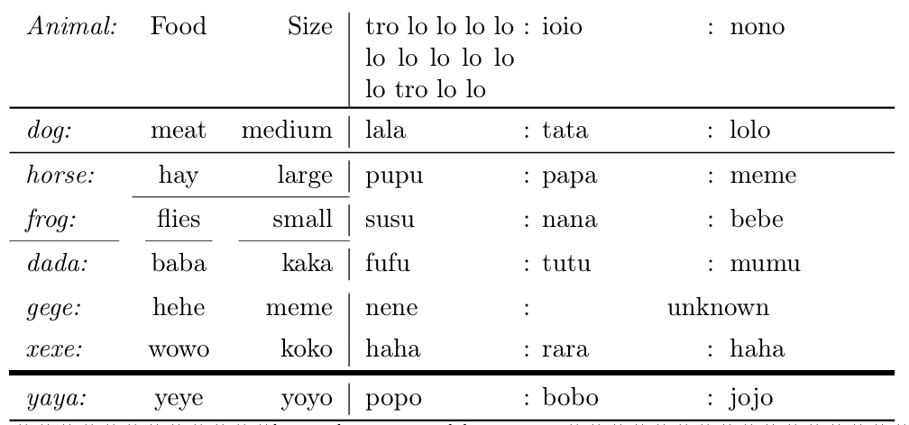
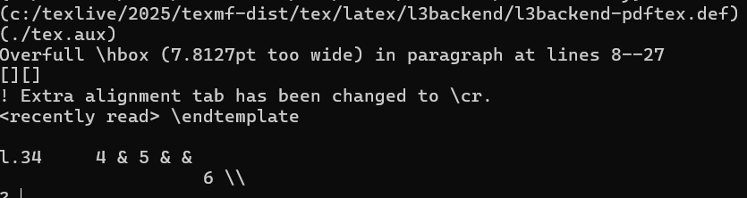

---
## Front matter
title: "Отчет по лабораторной работе №5"
subtitle: "Дисциплина: Computer Skills for Scientific Writing "
author: "Живцова Анна"

## Generic otions
lang: ru-RU
toc-title: "Содержание"

## Bibliography
bibliography: cite.bib
csl: pandoc/csl/gost-r-7-0-5-2008-numeric.csl

## Pdf output format
toc: true # Table of contents
toc-depth: 2
lof: true # List of figures
lot: true # List of tables
fontsize: 12pt
linestretch: 1.5
papersize: a4
documentclass: scrreprt
## I18n polyglossia
polyglossia-lang:
  name: russian
  options:
	- spelling=modern
	- babelshorthands=true
polyglossia-otherlangs:
  name: english
## I18n babel
babel-lang: russian
babel-otherlangs: english
## Fonts
mainfont: IBM Plex Serif
romanfont: IBM Plex Serif
sansfont: IBM Plex Sans
monofont: IBM Plex Mono
mathfont: STIX Two Math
mainfontoptions: Ligatures=Common,Ligatures=TeX,Scale=0.94
romanfontoptions: Ligatures=Common,Ligatures=TeX,Scale=0.94
sansfontoptions: Ligatures=Common,Ligatures=TeX,Scale=MatchLowercase,Scale=0.94
monofontoptions: Scale=MatchLowercase,Scale=0.94,FakeStretch=0.9
mathfontoptions:
## Biblatex
biblatex: true
biblio-style: "gost-numeric"
biblatexoptions:
  - parentracker=true
  - backend=biber
  - hyperref=auto
  - language=auto
  - autolang=other*
  - citestyle=gost-numeric
## Pandoc-crossref LaTeX customization
figureTitle: "Рис."
tableTitle: "Таблица"
listingTitle: "Листинг"
lofTitle: "Список иллюстраций"
lotTitle: "Список таблиц"
lolTitle: "Листинги"
## Misc options
indent: true
header-includes:
  - \usepackage{indentfirst}
  - \usepackage{float} # keep figures where there are in the text
  - \floatplacement{figure}{H} # keep figures where there are in the text
---

# Цель работы

Освоить опции оформления таблиц [@book]. 

# Задание

- Изучить материал         
- Протестировать изученные опции оформления таблиц     
- Ответить на контрольные вопросы     

# Выполнение лабораторной 

## Практическая отработка изученного  

Изучив материал я создала следующую таблицу

``` 
\begin{tabular}{>{\itshape}l<{:}cr|p{2cm}@{ : }m{2cm}!{:}b{2cm}}
Animal & Food & Size & tro lo lo lo lo lo lo lo lo lo lo tro lo lo & ioio & nono \\
\toprule
dog & meat & medium  & lala & tata & lolo \\
\midrule
horse & hay & large & pupu & papa & meme \\
\cmidrule{2-3}
frog & flies & small & susu & nana & bebe \\
\cmidrule(r){1-1}
\cmidrule(rl){2-2}
\cmidrule(l){3-3}
dada & baba & kaka & fufu & tutu & mumu \\
\addlinespace
gege & hehe & meme & nene & \multicolumn{2}{c}{unknown} \\[4pt]
xexe & wowo & koko & haha & rara & haha \\ 
\midrule[2pt]
yaya & yeye & yoyo & popo & bobo & jojo \\
\bottomrule
\end{tabular}
```

Для которой использовала пакеты ``` booktabs ``` и ```array```.

В результатае, после компиляции таблица имела следующий вид (см. рис. [-@fig:002])

{#fig:002}

В составлении данной таблицы были использованы следующие изученные мной команды и опции:     
- опции горизонтального выравнивания внутри ячейки таблицы ``` l, c, r, p{2cm}, m{2cm}, b{2cm} ```     
- опции, добавляющие к пробелам после столбца символы, ```|, @{:}, !{:}```      
- опции, добавляющие до и после текста ячеек одного столбца символы , ```>{\itshape}``` (до текста) ```<{:} ``` (после текста)      
- Команды для горизонтальных линий таблицы ```\toprule,  \midrule,  \midrule[2pt], \cmidrule{2-3}, \cmidrule(r){1-1}, \bottomrule```     
- команды и опции, добавляющие междустрочное расстояние ```\\[4pt],  \addlinespace```      
- команда для объединения ячеек ``` \multicolumn{2}{c}{unknown} ```     

## Контрольные вопросы

Я создала две дополнительные таблицы. В первой ввела меньше ячеек в строке, чем объявлено. Во второй ввела больше ячеек в строке, чем объявлено. Для второй таблицы во время компиляции было выведено предупреждение (см. рис.  [-@fig:001]) и переопределенное значение перенеслось на следующую строку. В таблице с недообъявленным значением оставленное пустым поле было пусто без лишних ошибок. вид таблиц представлен на рисунке [-@fig:003].

{#fig:001 width=80%}

{#fig:003 width=30%}

# Выводы

В данной работе я освоила опции оформления таблиц. Изучила и на практике применила способы горизонтального выравнивания, управления пробелами, создания горизонтальных линий, объединения ячеек, работы с размерами ячеек и талиц в целом. Также я изучила различные окружения для создания таблиц: ```tabular, tabularx, longtable```.   

# Список литературы{.unnumbered}

::: {#refs}
:::
