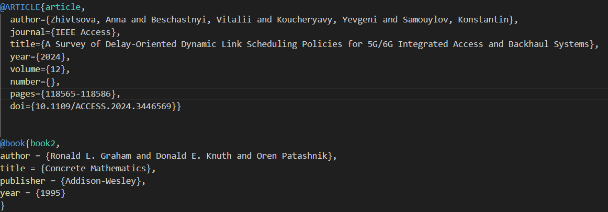
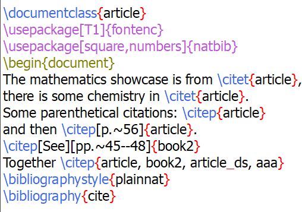
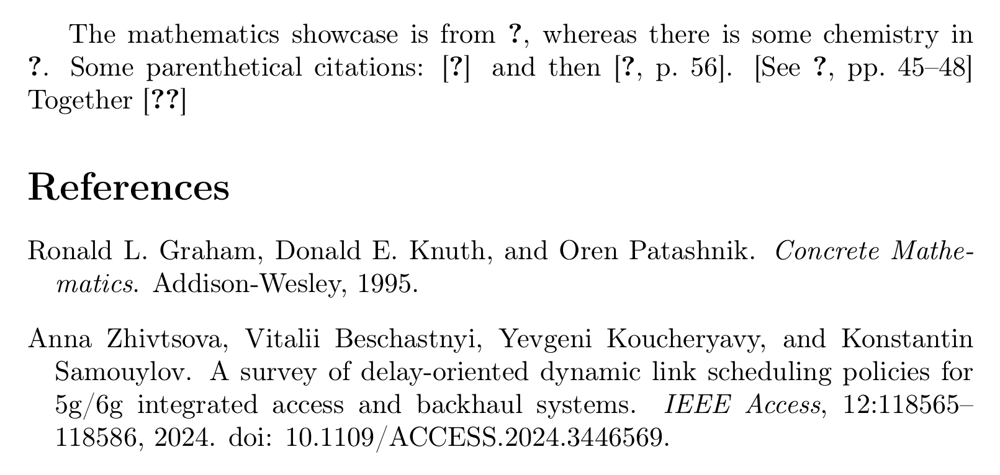
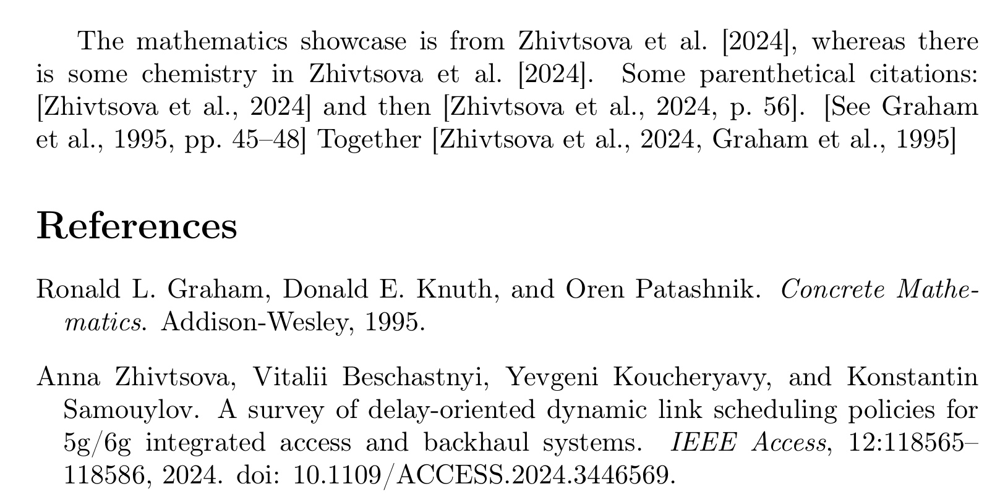
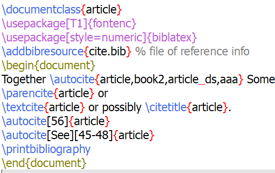
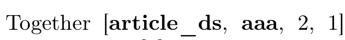
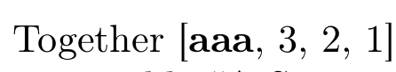

---
## Front matter
lang: ru-RU
title: Презентация по лабораторной работе №6
subtitle: Дисциплина "Computer Skills for Scientific Writing"
author:
  - Живцова А.А.
institute:
  - Кафедра теории вероятностей и кибербезопасности, Российский университет дружбы народов имени Патриса Лумумбы, Москва, Россия
date: 11 сентября 2024

## i18n babel
babel-lang: russian
babel-otherlangs: english

## Formatting pdf
toc: false
toc-title: Содержание
slide_level: 2
aspectratio: 169
section-titles: true
theme: metropolis
header-includes:
 - \metroset{progressbar=frametitle,sectionpage=progressbar,numbering=fraction}
---

# Информация

## Докладчик

:::::::::::::: {.columns align=center}
::: {.column width="70%"}

  * Живцова Анна Александровна
  * студент кафедры теории вероятностей и кибербезопасности
  * Российский университет дружбы народов имени Патриса Лумумбы
  * [zhivtsova_aa@pfur.ru](mailto:zhivtsova_aa@pfur.ru)
  * <https://github.com/AnnaZhiv>

:::
::: {.column width="30%"}


:::
::::::::::::::

# Вводная часть

## Актуальность

Использование LaTeX  критически важно для исследователей, так как это профессиональный стандарт для подготовки научных статей. Он обеспечивает отличное качество вёрстки, позволяет легко работать с библиографией и ссылками, что значительно ускоряет процесс написания исследований. 

## Объект и предмет исследования

- Дистрибутив TexLive          
- Оформление библиографии
- Пакеты для создания библиографии ```bibtex```, ```biblatex```          

## Цели и задачи

Освоить способы включения библиографии ```bibtex```, ```biblatex```.     

- Изучить материал         
- Создать базу данных с библиографией в формате ```.bib```     
- Реализовать библиографию с помощью  ```bibtex``` (```natbib```) и  ```biblatex``` (```biber```)     
- Провести  эксперименты с использованием разных стилй цитирования, добавлением новых элементов в базу данных ииспоьзованием неопределенных эелементов        

## Материалы и методы

- Дистрибутив TexLive         
- Компилятор pdflatex     
- Пакеты ```bibtex```, ```biblatex```

# Результаты

## Файл с библиографичскими данными 

{width=90%}

## Реализация  библиографию с помощью  ```bibtex``` (```natbib```). Код

{width=90%}

##  ```bibtex``` (```natbib```). Компиляция 1

{width=90%}

##  ```bibtex``` (```natbib```). Компиляция 2

{width=90%}

##  ```bibtex``` (```natbib```). Компиляция 3

{width=90%}

## Реализация  библиографию с помощью  ```biblatex``` (```biber```).  Код 

{width=90%}

## ```biblatex``` (```biber```).  Компиляция 1

{width=90%}

## ```biblatex``` (```biber```).  Компиляция 2

{width=90%}

## Использование численного стиля ссылок ```BibTex```

{width=90%}

## Использование численного стиля ссылок ```BibLaTex```

{width=90%}

## Добавление новых (в том числ еопределенных) ссылок

{width=15%}

{width=15%}

{width=15%}

{width=15%}

# Выводы

В данной работе я освоила базовое оформление библиографии с с помощью  ```bibtex``` (```natbib```) и  ```biblatex``` (```biber```). Я провеа эксперименты с двумя разными стилями цитирования, а также выяснила, что процедуру последовательности компиляций нужно производить при добавлении каждого нового цитирования