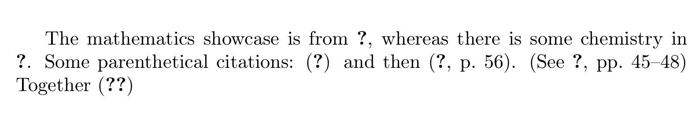
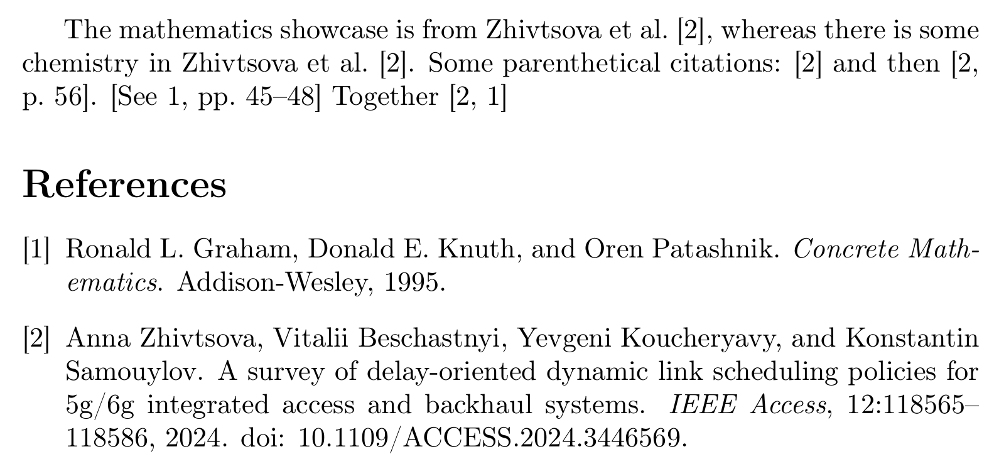
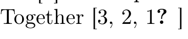

---
## Front matter
title: "Отчет по лабораторной работе №6"
subtitle: "Дисциплина: Computer Skills for Scientific Writing "
author: "Живцова Анна"

## Generic otions
lang: ru-RU
toc-title: "Содержание"

## Bibliography
bibliography: cite.bib
csl: pandoc/csl/gost-r-7-0-5-2008-numeric.csl

## Pdf output format
toc: true # Table of contents
toc-depth: 2
lof: true # List of figures
lot: true # List of tables
fontsize: 12pt
linestretch: 1.5
papersize: a4
documentclass: scrreprt
## I18n polyglossia
polyglossia-lang:
  name: russian
  options:
	- spelling=modern
	- babelshorthands=true
polyglossia-otherlangs:
  name: english
## I18n babel
babel-lang: russian
babel-otherlangs: english
## Fonts
mainfont: IBM Plex Serif
romanfont: IBM Plex Serif
sansfont: IBM Plex Sans
monofont: IBM Plex Mono
mathfont: STIX Two Math
mainfontoptions: Ligatures=Common,Ligatures=TeX,Scale=0.94
romanfontoptions: Ligatures=Common,Ligatures=TeX,Scale=0.94
sansfontoptions: Ligatures=Common,Ligatures=TeX,Scale=MatchLowercase,Scale=0.94
monofontoptions: Scale=MatchLowercase,Scale=0.94,FakeStretch=0.9
mathfontoptions:
## Biblatex
biblatex: true
biblio-style: "gost-numeric"
biblatexoptions:
  - parentracker=true
  - backend=biber
  - hyperref=auto
  - language=auto
  - autolang=other*
  - citestyle=gost-numeric
## Pandoc-crossref LaTeX customization
figureTitle: "Рис."
tableTitle: "Таблица"
listingTitle: "Листинг"
lofTitle: "Список иллюстраций"
lotTitle: "Список таблиц"
lolTitle: "Листинги"
## Misc options
indent: true
header-includes:
  - \usepackage{indentfirst}
  - \usepackage{float} # keep figures where there are in the text
  - \floatplacement{figure}{H} # keep figures where there are in the text
---

# Цель работы

Освоить способы включения библиографии ```bibtex```, ```biblatex``` [@book]. 

# Задание

- Изучить материал         
- Создать базу данных с библиографией в формате ```.bib```     
- Реализовать библиографию с помощью  ```bibtex``` (```natbib```) и  ```biblatex``` (```biber```)     
- Провести  эксперименты с использованием разных стилй цитирования, добавлением новых элементов в базу данных ииспоьзованием неопределенных эелементов        

# Выполнение лабораторной 

При выполнении работы использовался файл ```cite.ibb```, содержащий запись о книге с меткой ```book2``` и запись о статье с меткой ```article```. Оба источника описаны на латинице. 

## Реализация  библиографию с помощью  ```bibtex``` (```natbib```)

Для организации библионрафии в преамбуде подключили пакет ```natbib``` с помощью команды 

```\usepackage{natbib}```

и в конце докемента, где предполагается появление списка источников, добавили строчки

```
\bibliographystyle{plainnat}
\bibliography{cite}
```

определяющие стиль цитирования и базу данных для цитирования. Первые два цитирования реализуем с помощью команды ```\citet{}``` остальные с пмощью ```\citep{}```. 

После первой компиляции документ имел следующий вид (см. рис. [-@fig:001]).

{#fig:001}

После компиляции с помощью ```BibTex``` и второй компиляции документ имел следующий вид (см. рис. [-@fig:002]).

{#fig:002}

Псоле еще одной компиляции документ принял свой итоговый желаемый нами образ (см. рис. [-@fig:003]).

{#fig:003}

## Реализация  библиографию с помощью  ```biblatex``` (```biber```)   

Для организации библионрафии в преамбуде подключили пакет ```biblatex``` с помощью команды 

```
\usepackage[style=authoryear]{biblatex}
```
и указали файл с базой данных для цитирования с помощью команды 

```
\addbibresource{cite.bib}
```

В конце докемента, где предполагается появление списка источников, добавили команды вывода библиографии ```\printbibliography```. Первое цитирование реализуем с помощью команды ```\autocite{}```, далее используется ``` \parencite{}```, ```\textcite{}``` и  ```\citetitle```, далее опять используется  ```\autocite{}``` с одной и двумя опциями соответственно. 

После первой компиляции документ имел следующий вид (см. рис. [-@fig:004]).

{#fig:004}

После компиляции с помощью ```Biber``` и второй компиляции документ имел следующий итоговый вид (см. рис. [-@fig:005]).

{#fig:005}

## Использование численного стиля ссылок

Для ```BibTex``` перед импортом ```natbib``` следует поставить опцию ```[numbers]``` тогда вид ссылок следующий (см. рис. [-@fig:006]).

{#fig:006}

Для ```BibLaTex``` перед импортом ```bibltex``` следует поставить опцию ```[style=numeric]``` тогда вид ссылок следующий (см. рис. [-@fig:007]).

{#fig:007}

## Добавление новых ссылок

Добавим одну запись в файл ```cite.bib```. В документе процитируем новую метку и одну метку не определенную в файле ```cite.bib```. Проведем процесс последовательностей компиляции для ```bibtex``` и ```biblatex``` (см. рис.  [-@fig:008],  [-@fig:009],  [-@fig:010],  [-@fig:011]).

{#fig:008}

{#fig:009}

{#fig:010}

{#fig:011}

# Выводы

В данной работе я освоила базовое оформление библиографии с с помощью  ```bibtex``` (```natbib```) и  ```biblatex``` (```biber```). Я провеа эксперименты с двумя разными стилями цитирования, а также выяснила, что процедуру последовательности компиляций нужно производить при добавлении каждого нового цитирования

# Список литературы{.unnumbered}

::: {#refs}
:::
